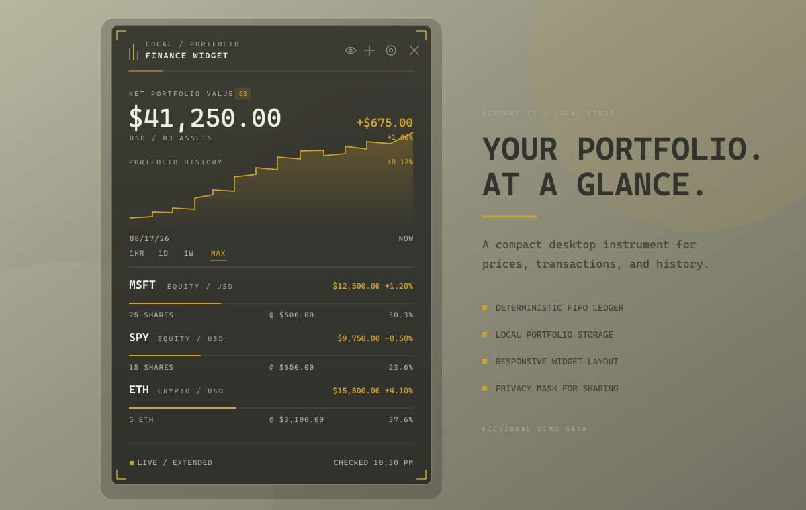

# Finance Widget

[](https://github.com/Copypaster3000/finance-widget/actions/workflows/ci.yml)
[](https://github.com/Copypaster3000/finance-widget/actions/workflows/security.yml)
[](https://github.com/Copypaster3000/finance-widget/releases/latest)
[](LICENSE)

A compact, local-first portfolio widget for Windows 11. Finance Widget combines a warm Linux-rice visual language with a deterministic transaction ledger, responsive layout, privacy controls, and historical portfolio reconstruction.



<p align="center"><em>Fictional demo data. No personal portfolio information is included.</em></p>

## Highlights

- Frameless, translucent desktop widget with optional always-on-top and taskbar modes.
- Responsive layout that scales from a chart-focused strip to the full portfolio view.
- Stocks, OTC symbols, and crypto with regular or available extended-hours prices.
- Dated BUY and SELL ledger with FIFO cost basis, fees, realized gain, and unrealized gain.
- Per-transaction control over whether a trade affects tracked Cash and Margin Debt.
- Historical portfolio chart reconstructed from the quantities held on each date.
- Hourly history plus higher-resolution recent points when using faster refresh modes.
- Manual, hourly, 15-minute, and 15-second refresh choices.
- Privacy mode masks values and quantities before sharing the screen.
- All portfolio records remain in the local Tauri application-data store.

## Install

1. Open the [latest release](https://github.com/Copypaster3000/finance-widget/releases/latest).
2. Download the Windows x64 setup executable.
3. Optionally verify it against `SHA256SUMS.txt`, then run the installer.
4. Launch **Finance Widget** from the Start Menu.

The initial hobby release is not code-signed, so Windows may identify the publisher as unknown. Only install artifacts downloaded from this repository's Releases page and verify the published checksum.

Finance Widget starts with an empty portfolio. Add an asset, then record dated BUY or SELL transactions. Cash and Margin Debt rows remain hidden unless enabled in Configuration.

## Ledger model

- BUY accepts Price / Unit plus fees or an all-in Total Paid.
- SELL accepts Price / Unit plus fees or net Total Proceeds.
- Every trade independently chooses whether tracked Cash and Debt should change.
- Funded buys consume Cash before creating Debt.
- Funded sales and deposits pay Debt before creating Cash.
- Withdrawals consume Cash before increasing Debt.
- Money is replayed as integer cents; quantities use eight decimal places and prices use six.
- Sales consume acquisition lots FIFO.

Historical value replays the ledger through each chart point and values the reconstructed quantities alongside Cash minus Debt. The chart therefore represents actual account value, not contribution-adjusted investment performance; deposits and withdrawals can create legitimate jumps.

## Privacy and storage

Configuration, transactions, quote caches, historical prices, and window state are stored locally under the Tauri application-data directory for `com.copypaster3000.finance-widget`.

On Windows, portfolio records live in `%APPDATA%\com.copypaster3000.finance-widget\portfolio.json`, independently of the executable. Saves replace the file atomically and retain the previous valid file as `portfolio.json.bak`. A damaged file can recover from that backup; unreadable storage stops loading with an error instead of silently opening an empty portfolio. A second running copy cannot overwrite changes it has not loaded. Keep separate backups for long-term recovery; the automatic backup contains only the previous save.

Only requested symbols and historical time bounds are sent to the market-data source. Quantities, transaction records, Cash, Debt, cost basis, totals, and gains remain local. The app does not collect API credentials or telemetry.

Repository examples, screenshots, and tests use synthetic data. Please do not attach real portfolio values, local stores, or unredacted screenshots to public issues.

## Market-data note

Yahoo Finance currently supplies normalized regular, extended, overnight-when-available, OTC, crypto, and historical data through an unofficial best-effort adapter. Availability and response formats can change without notice. Cached real quotes remain visible through partial outages and are labeled accordingly; demo values are never silently presented as real valuations.

## Build from source

Requirements: Windows 11 x86-64, Node.js 20+, Rust stable with MSVC, Visual Studio C++ Build Tools, and WebView2.

```powershell
npm install
npm run privacy:check
npm run check
npm test
npm run build
npm run tauri dev
npm run tauri build
```

If Cargo is not already on the current PowerShell path:

```powershell
$env:Path = "C:\Users\$env:USERNAME\.cargo\bin;$env:Path"
```

The NSIS installer is written to `src-tauri/target/release/bundle/nsis`.

## Architecture

- `src/lib/ledger.ts` — fixed-precision chronological replay, FIFO, Cash, Debt, and validation.
- `src/lib/transactions.ts` — BUY/SELL normalization and Total Paid/Proceeds semantics.
- `src/lib/ledgerHistory.ts` — raw price caching and ledger-aware historical valuation.
- `src/lib/portfolio.ts` — current net valuation and gross-asset allocations.
- `src/lib/providers.ts` — provider boundary and quote normalization.
- `src/lib/feed.ts` — quote provenance, cache preference, and feed state.
- `src/lib/calendar.ts` — local calendar boundaries and provider-timezone conversion.
- `src/lib/storage.ts` — schema migration and app-data persistence.
- `src-tauri/src/persistence.rs` — validated native reads, atomic saves, recovery backup, and conflicting-write protection.
- `src/components` — portfolio, configuration, transaction, Cash, and Debt views.
- `src-tauri` — frameless Windows shell, native integration, and installer.

## Scope

Corporate actions, dividends, options, short positions, interest accrual, brokerage imports, tax reporting, manual tax-lot selection, wash sales, multi-currency accounting, and contribution-adjusted returns are not implemented.

See [CONTRIBUTING.md](CONTRIBUTING.md) before opening a pull request. Security concerns can be reported privately according to [SECURITY.md](SECURITY.md).

## License

Finance Widget is available under the [MIT License](LICENSE).
